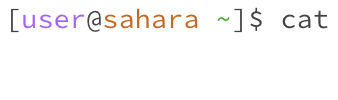
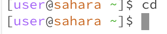
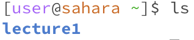
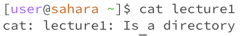
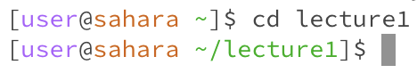
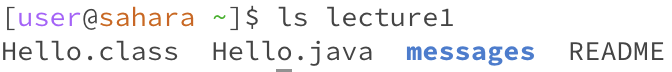
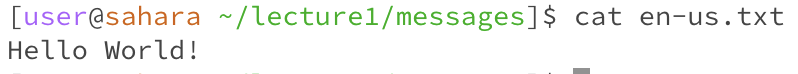
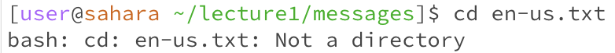
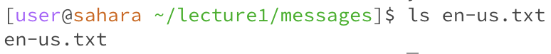

# Lab Report 1

## No Argument Examples
1. <code>cat</code> 

- /home as working directory
- There was no output as the the cat command defaulted to the terminal as there was no file to read. This then makes future inputs essentially spit back at you as <code>cat</code> types whatever you put in.
- This is not an error 

2. <code>cd</code>

- /home as working directory
- There is no output as it was already inside the /home directory and the command had no argument, thus making it return to the /home directory regardless 
- There is no error

4.<code>ls</code>

- /home as working directory
- the output is <code>lecture1</code> as the command prints out all available files and directories found in the current directory
- there is no error

---

## Path to Directory Examples
1. <code>cat lecture1</code> 

- /home as working directory
- The ouptut is <code>cat: lecture1: Is a directory</code> as the argument iss a directory/folder of its files, and the command <code>cat</code> must have a file as its argument.
- There is an error in the output as <code>cat</code> cannot display any file content considering that <code>lecture1</code> is a directory and not a file

2. <code>cd lecture1</code>

- /home as the original working directory
- the output is a change in the working directory as the user is now inside the <code>lecture1</code> directory. This is reflected in the shell prompt in the next line of the terminal
- There is no error

3. <code>ls lecture1</code>

- /home as working directory
- the output shows all the different files and further directories inside the <code>lecture1</code> directory. This includes `Hello.class`, `Hello.java`, `messages` directory, and `README`.
- There is no error

---

## Path to File
1. `cat en-us.txt`

- /lecture1/messages is the path for the working directory when the command was inputted
- The output is the message `Hello World!` which is printed from the file `en-us.txt` after being parsed throughn the Hello.java file
- There is no error

2. `cd en-us.txt`

- /lecture1/messages is the path for the working directory when the command was inputted
- The output is the error `bash: cd: en-us.txt: Not a directory` as there is an error with the `cd` command considering the command is used to change the current directory the user is in.
- The output is an error as the `cd` command is used incorrectly as it has to have either nothing or a directory as an argument, not a file

3. `ls en-us.txt`

- /lecture1/messages is the path for the working directory when the command was inputted
- The output is the name of the file `en-us.txt`. This is because the correct syntax for `ls` is to have a directory, not a file, as an argument. As such, the contents of the file are ignored and the file name used as the argument is simply printed out again as the output
- There is no technical error, but this is incorrect syntax. 
